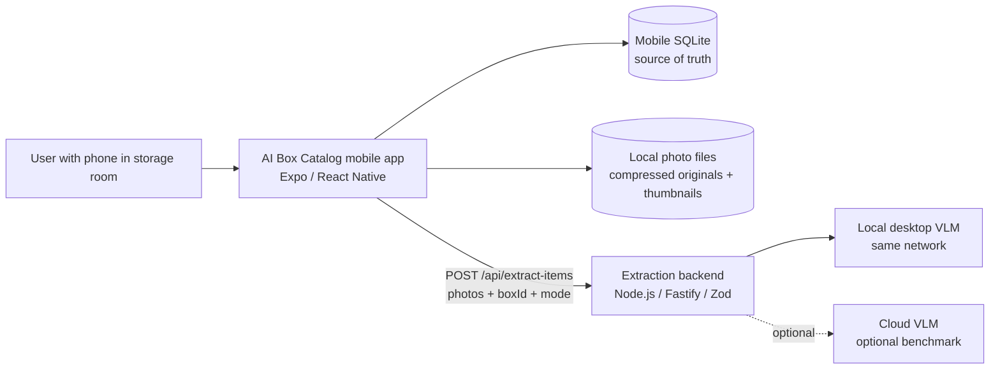
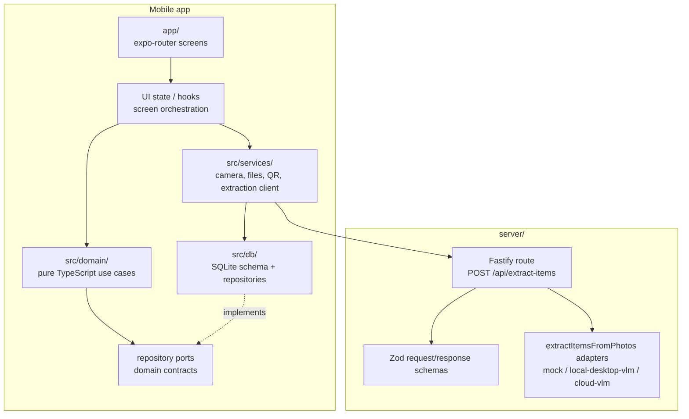
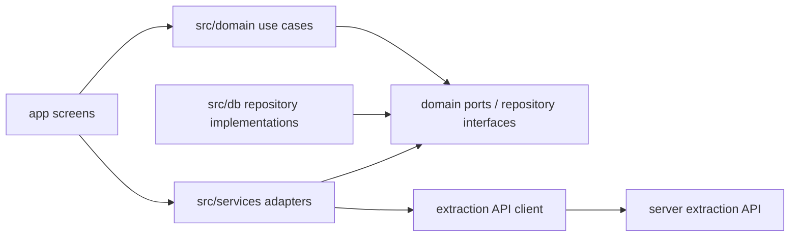
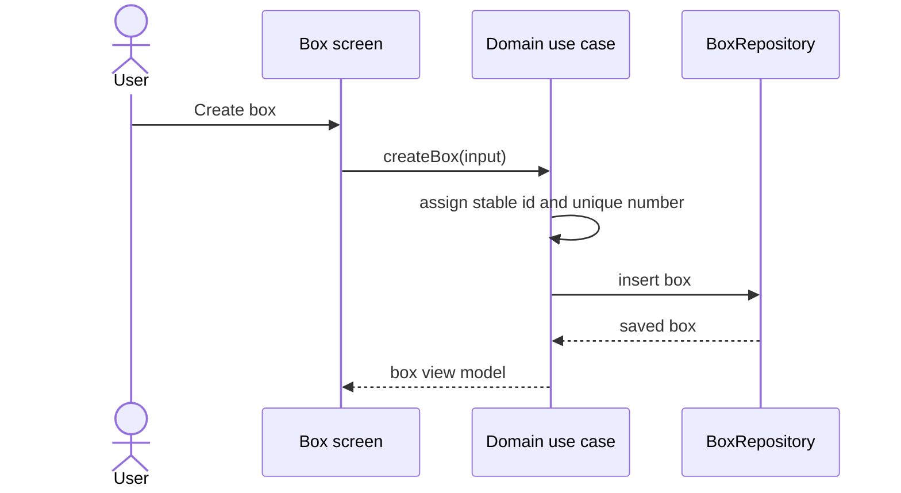
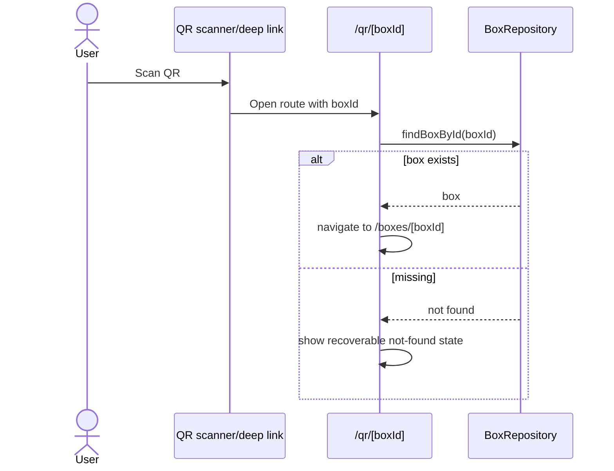
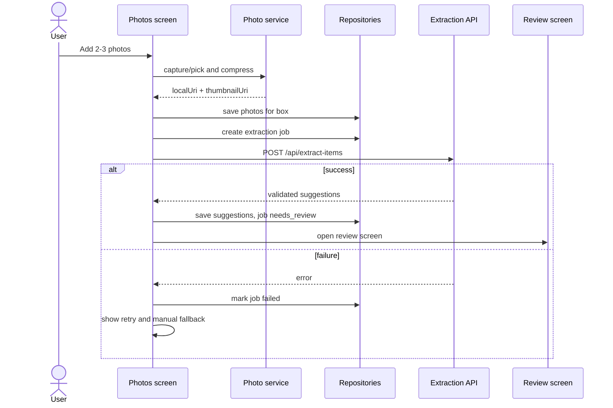
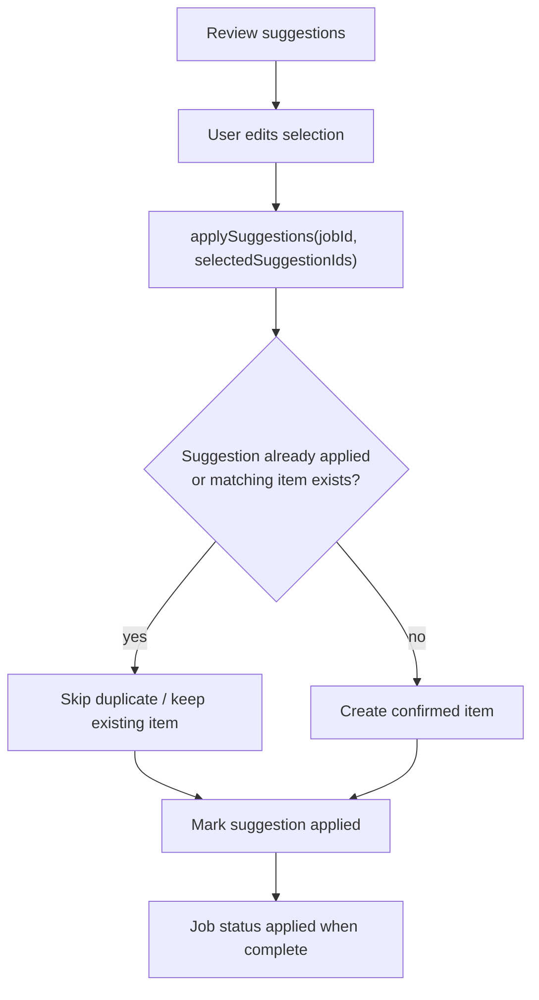
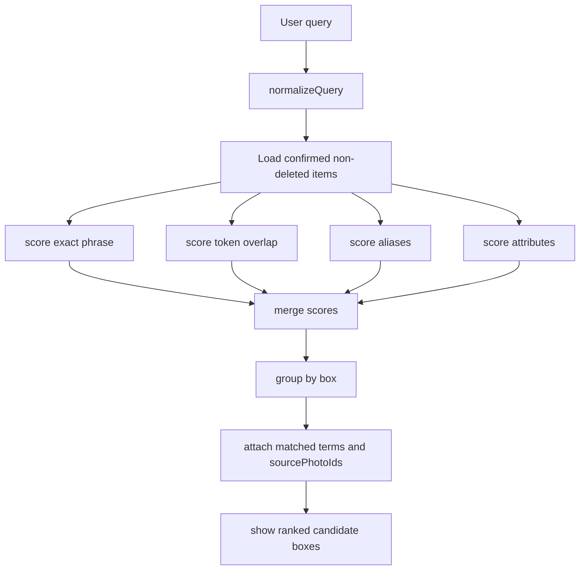

# Architecture: AI Box Catalog

Status: DRAFT
Implementation source of truth: [android-mvp-plan.md](./android-mvp-plan.md)
Product source: [ai-box-catalog-design.md](./ai-box-catalog-design.md)
QA source: [test-plan.md](./test-plan.md)

Этот документ описывает архитектуру, на которую должен опираться разработчик при
реализации Android-first MVP. Если возникает конфликт между этим документом и
`docs/android-mvp-plan.md`, сначала обновить план или архитектуру, а не расходиться
в коде.

## 1. Architectural Decision

Проект строится как локальный mobile-first модульный монолит на React Native,
Expo и TypeScript.

Основные решения:

- Mobile app является главным продуктом и владельцем доменных данных.
- SQLite в мобильном приложении является source of truth для boxes, items, photos,
  extraction jobs и suggestions.
- Backend нужен только как adapter boundary для извлечения предметов из фото.
- AI никогда не пишет confirmed items напрямую. AI возвращает только suggestions,
  которые пользователь подтверждает на review screen.
- QR payload всегда содержит стабильный `boxId`, а не изменяемый номер коробки.
- Поиск работает локально по confirmed items и показывает candidate boxes с photo
  evidence, а не один "точный" ответ.

Выбранный архитектурный стиль:

- Modular monolith внутри мобильного приложения: быстрый MVP, один runtime,
  простые транзакции и понятные границы модулей.
- Ports and adapters для нестабильных интеграций: SQLite, camera/gallery, QR,
  file storage, extraction backend, VLM providers.
- Microservices, CQRS и event sourcing не используются в MVP: они добавят
  операционную сложность без пользы для персонального локального каталога.

## 2. System Context



Контекстные правила:

- Приложение должно быть полезным без live AI: manual item entry и mock extraction
  обязательны для разработки и тестов.
- Backend не хранит основной каталог. Он может валидировать запрос, вызвать модель
  и вернуть suggestions, но не становится владельцем boxes/items/photos.
- Фото являются личными данными. Не логировать image payloads и item names без
  явной локальной отладки.

## 3. Runtime Containers



Container responsibilities:

| Container | Responsibility | Must not do |
|---|---|---|
| `app/` | Screens, routes, navigation, UI state, user actions | Own domain rules or SQL details |
| `src/domain/` | Entities, use cases, validation, search scoring, suggestion apply rules | Import Expo, React, SQLite, Fastify, file APIs |
| `src/db/` | SQLite schema, migrations, repository implementations | Decide UX behavior or call AI |
| `src/services/` | Adapters for QR, photos, file storage, extraction API, device capabilities | Bypass domain rules |
| `server/` | Validate extraction request, call selected extractor, return structured suggestions | Store source-of-truth catalog data |
| `tests/` | Unit tests for pure domain and repositories | Depend on real camera or live AI |
| `e2e/` | Maestro Android flows | Replace unit coverage for domain edge cases |

## 4. Dependency Rules



Правила импортов:

- `src/domain` не импортирует `react`, `react-native`, `expo-*`, `fastify` или
  конкретный SQLite driver.
- `app` вызывает use cases и adapters, но не выполняет SQL напрямую.
- `src/db` реализует repository contracts и содержит migrations.
- `server` переиспользует shared schema/types только если это не тянет мобильные
  зависимости в backend.
- Общие типы для extraction contract можно вынести в `src/domain/extraction/types.ts`
  или `shared/`, если появится реальная необходимость.

## 5. Planned Project Structure

```text
app/
  _layout.tsx
  index.tsx
  boxes/index.tsx
  boxes/new.tsx
  boxes/[boxId]/index.tsx
  boxes/[boxId]/photos.tsx
  boxes/[boxId]/review/[jobId].tsx
  qr/[boxId].tsx

src/
  domain/
    boxes/
    items/
    photos/
    extraction/
    search/
    qr/
  db/
    migrations/
    schema.ts
    repositories/
  services/
    extraction/
    files/
    photos/
    qr/
  ui/
    components/
    hooks/

server/
  src/
    routes/extractItems.ts
    schemas/extractionSchemas.ts
    extractors/

tests/
e2e/
```

`src/ui` можно добавить после scaffold, если компоненты начинают повторяться. До
этого экраны в `app/` могут держать локальные маленькие компоненты рядом с route.

## 6. Domain Model

### Box

Fields:

- `id`: stable UUID.
- `number`: human-readable unique local number.
- `label`: optional user label.
- `createdAt`, `updatedAt`.

Rules:

- `number` уникален в локальном каталоге.
- QR/deep link строится из `id`, не из `number`.
- Удаление box с items/photos должно иметь confirmation или быть отложено до v2.

### Item

Fields:

- `id`: stable UUID.
- `boxId`.
- `name`: canonical confirmed name.
- `aliases`: optional search aliases.
- `attributes`: `color`, `category`, `season`, `material`.
- `source`: `manual` или `ai_confirmed`.
- `sourceSuggestionId`: optional.
- `sourcePhotoIds`: photos that justify the item.
- `createdAt`, `updatedAt`, `deletedAt`.

Rules:

- Search uses only non-deleted confirmed items.
- Empty names are rejected.
- Duplicate accepted suggestions in the same box must be idempotent: no duplicate
  items after repeat apply.

### BoxPhoto

Fields:

- `id`: stable UUID.
- `boxId`.
- `localUri`: compressed local file URI.
- `thumbnailUri`: local thumbnail URI.
- `width`, `height`, `byteSize`.
- `takenAt`, `createdAt`.

Rules:

- A photo belongs to exactly one box.
- Extraction jobs cannot mix photos from different boxes.
- Failed extraction never deletes photos.

### ExtractionJob

Fields:

- `id`.
- `boxId`.
- `photoIds`.
- `mode`: `mock`, `local-desktop-vlm`, `cloud-vlm`.
- `status`: `pending`, `running`, `needs_review`, `failed`, `applied`.
- `errorMessage`.
- `createdAt`, `updatedAt`.

Rules:

- Jobs are retryable.
- A job reaches `needs_review` only after response validation succeeds.
- Applying suggestions transitions job to `applied` without creating duplicates.

### ItemSuggestion

Fields:

- `id`.
- `jobId`.
- `name`.
- `attributes`.
- `sourcePhotoIds`.
- `reason`.
- `selectedByDefault`.
- `status`: `active`, `edited`, `deleted`, `applied`.

Rules:

- Suggestions are disposable drafts.
- User can add all, add selected, rename, delete, or add a missing manual item.
- Unconfirmed suggestions are never searchable.

## 7. SQLite Schema

Initial tables:

```text
schema_migrations
boxes
items
box_photos
extraction_jobs
item_suggestions
```

Recommended constraints:

```text
boxes.id primary key
boxes.number unique not null

items.id primary key
items.box_id references boxes(id)
items.name not null
items.deleted_at nullable

box_photos.id primary key
box_photos.box_id references boxes(id)

extraction_jobs.id primary key
extraction_jobs.box_id references boxes(id)

item_suggestions.id primary key
item_suggestions.job_id references extraction_jobs(id)
```

Add indexes before user-facing search/review work:

```text
items(box_id)
items(name)
items(deleted_at)
box_photos(box_id)
extraction_jobs(box_id, status)
item_suggestions(job_id, status)
```

For MVP, do not introduce remote sync tables, user accounts, or cloud ownership.

## 8. Core Flows

### Create Box



### QR Navigation



### Photo Extraction



### Apply Suggestions



### Search



## 9. Extraction API Contract

Endpoint:

```text
POST /api/extract-items
```

Request:

```ts
type ExtractionMode = 'mock' | 'local-desktop-vlm' | 'cloud-vlm';

type ExtractItemsRequest = {
  boxId: string;
  photoIds: string[];
  mode: ExtractionMode;
};
```

Response:

```ts
type ExtractItemsResponse = {
  suggestions: ItemSuggestion[];
};

type ItemSuggestion = {
  id: string;
  name: string;
  attributes?: {
    color?: string;
    category?: string;
    season?: string;
    material?: string;
  };
  sourcePhotoIds: string[];
  reason?: string;
  selectedByDefault: boolean;
};
```

Validation rules:

- Mobile side rejects jobs where selected photos belong to different boxes.
- Server validates request and response with Zod.
- Server rejects oversized or invalid image inputs once uploads are implemented.
- Invalid model output becomes job failure, not partially trusted catalog data.
- `cloud-vlm` remains optional benchmark, not an MVP dependency.

## 10. Search Architecture

Search starts as deterministic local TypeScript logic, not embeddings or a remote
search service.

Scoring inputs:

- exact phrase match in `item.name`;
- token overlap between query and item name;
- alias match;
- attribute match for color/category/season/material;
- optional source photo evidence from `sourcePhotoIds`.

Result shape:

```ts
type SearchResult = {
  boxId: string;
  boxNumber: string;
  score: number;
  matchedItems: Array<{
    itemId: string;
    name: string;
    matchedTerms: string[];
    sourcePhotoIds: string[];
  }>;
};
```

Rules:

- Search only confirmed, non-deleted items.
- Multiple weak matches are shown as candidates.
- Empty and no-results states are explicit.
- Embeddings are deferred until real fixture data proves keyword/attribute search is
  not enough.

## 11. Testing Architecture

Unit tests with Vitest:

- pure domain functions;
- repository methods against test SQLite database;
- suggestion apply idempotency;
- search scoring and grouping;
- QR payload generation.

E2E tests with Maestro:

- create first box;
- manual add/delete item;
- add 2-3 photos;
- mock extraction and selected suggestion apply;
- QR route opens by stable `boxId`;
- extraction failure exposes retry/manual fallback.

AI eval fixture:

- 3 real boxes;
- 2-3 photos per box;
- expected item list per box;
- 5 search queries per box;
- success means correct box appears in top 2 for each query.

Do not call live AI from ordinary unit tests. Use mock or recorded responses.

## 12. Performance Targets

MVP targets:

- Box list opens under 500 ms with 50 boxes.
- Search returns under 200 ms for 1,000 confirmed items.
- Photo extraction can be slow, but must show loading, retry and manual fallback.
- Photos are compressed before local storage and before extraction upload.

Avoid:

- re-running extraction on every retry unless the user explicitly starts it;
- full-resolution photo storage without a later cleanup plan;
- remote search for the MVP dataset;
- rendering huge item/photo lists without pagination or virtualization if the UI
  becomes slow.

## 13. Security And Privacy

- No AI provider keys in mobile code.
- Backend validates request and response shapes.
- Backend should not log image payloads.
- Item names and photo metadata are personal data.
- Strip EXIF metadata where possible before sending photos to extraction.
- Local photos remain local unless the user starts extraction.

## 14. Implementation Order

1. Scaffold Expo app, TypeScript, expo-router and test tooling.
2. Add SQLite schema, migrations and repository contracts.
3. Implement local box catalog: create/list/open boxes, manual add/delete items.
4. Implement local search over confirmed items.
5. Add QR generation and `/qr/[boxId]` route.
6. Add photo capture/gallery picker, compression, local file storage and thumbnails.
7. Add mock extraction backend/client and review screen.
8. Add `local-desktop-vlm` extractor behind the same contract.
9. Add evidence search UI with candidate boxes and photo thumbnails.
10. Add AI eval fixture and Maestro flows.

## 15. Architecture Guardrails

Do not merge implementation that:

- persists AI suggestions as confirmed items without review;
- ties QR identity to box number;
- sends provider keys to mobile code;
- lets extraction jobs mix photos from different boxes;
- deletes photos after extraction failure;
- makes backend the owner of catalog state;
- adds accounts, sync, payments or exact object highlighting to MVP scope;
- introduces live AI dependency into normal unit tests.
